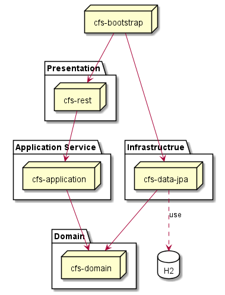
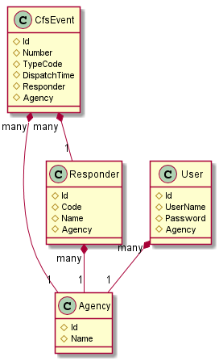
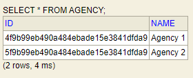
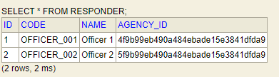
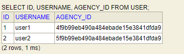
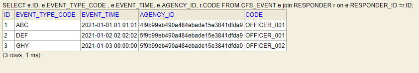
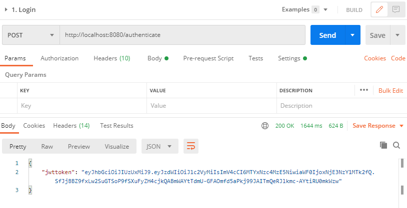
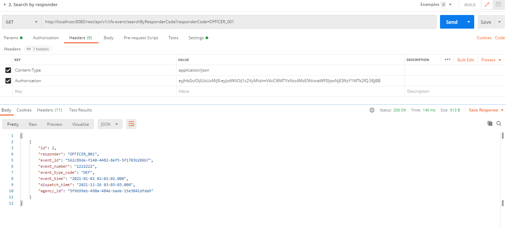
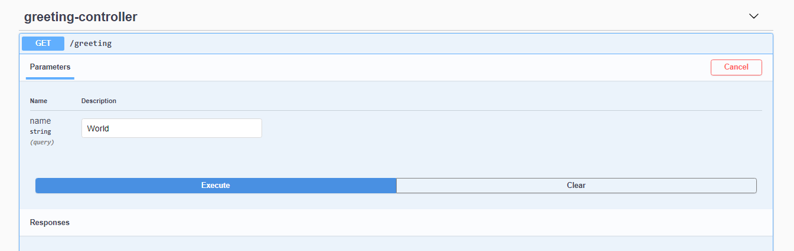

#Call for service

## Architecture

# Entity table

# Fix data
### Agency  

### Responder  

* Responder OFFICER_001 belong to agency 1
* Responder OFFICER_002 belong to agency 2
### User  

* user1 belong to agency 1
* user2 belong to agency 2
### Cfs Event  

#How to run application
    * If you want test by postman with security feature, you could run file CfsApplication.java
    * You can test swagger with no security feature when run file LocalCfsApplication.java   
#Login step with post mena
* Call this CURL to receive the token
  http://localhost:8080/authenticate
  
* Use this token for next request in authorization header
  
 You could import "cfs.postman_collection" to postman project   

#Solution for 
##  User should be able to create a CFS with the following information: event number, event type (with type code), event time, dispatch time, responder:
- User can run the POST method to the link <http://localhost:8080/rest/api/v1/cfs-event/create>
## User should be able to search for CFS within a time range with paging and sorting order.
<http://localhost:8080/rest/api/v1/cfs-event/searchByEventTime?eventTimeFrom=2021-01-02 03:00:00.000&eventTimeTo=2021-01-03 00:00:00.000>

- With pagable object user could search a CFS wtih a time range with paging and sorting order.
## User should be able to search for CFS that assigned to a responder.
- Just have api in link <http://localhost:8080/rest/api/v1/cfs-event/searchByResponderCode?responderCode=OFFICER_001>
## CFS belongs to different agencies are not allowed to be exposed to other agencies.
<http://localhost:8080/rest/api/v1/cfs-event/create>
- We could filter the search result with agency. User belong to agency just only search with CFS event in this agency
##User and responder should belong to only one agency
<http://localhost:8080/rest/api/v1/cfs-event/create>
- When create a CFS, we not allow to create a CFS with the agency of user differ from the agency of responder
#Technical stack
##Architecture: Hexagonal, Domain driven design
##Library: Spring boot, Jpa, Lombok, Mapstruct

#API  Documentation
Swagger use to help user can execute the rest API with documentation
Link: <http://localhost:8080/swagger-ui.html>

#H2
* Console link: http://localhost:8080/h2-console
* Database name:jdbc:h2:mem:testdb
* User: sa
* Pass: